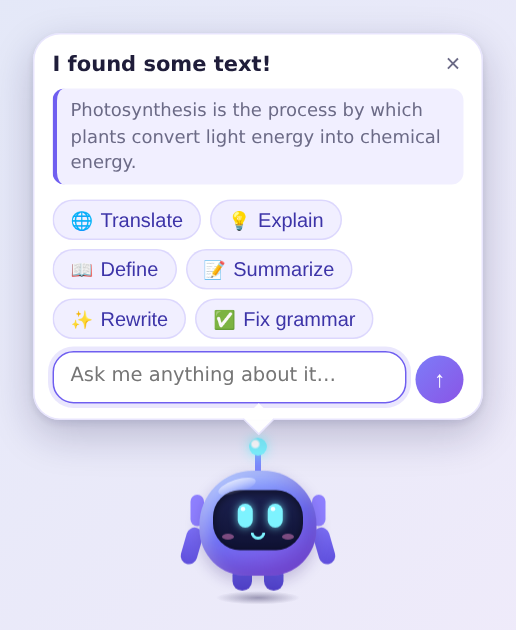
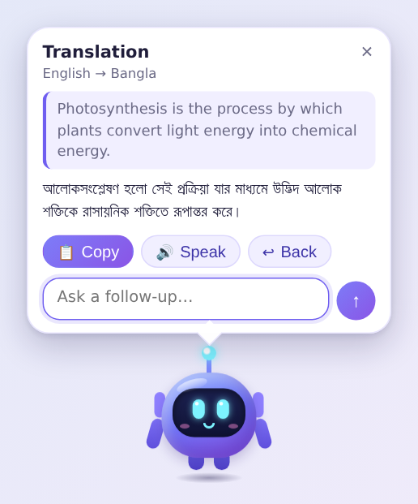
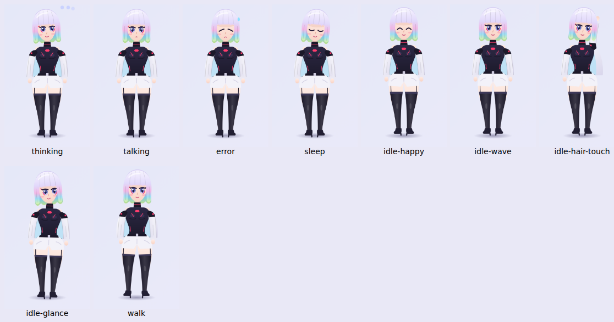
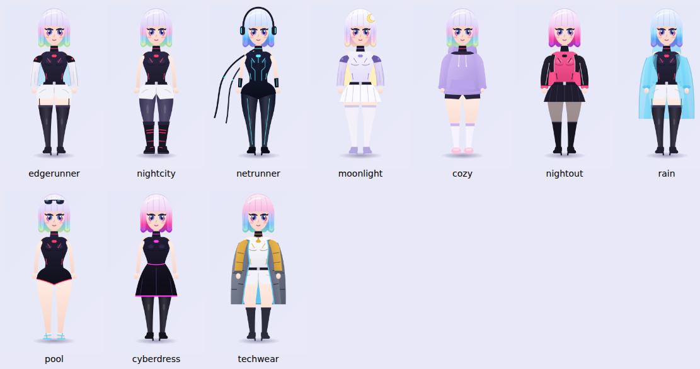

# 🤖 AI Pet — Lucy

A tiny, lightweight AI companion that lives on your macOS desktop. **Lucy** (inspired by the
netrunner from *Cyberpunk: Edgerunners*) floats above your windows, wanders around, and when you
press **⌥P** she pops up next to whatever text you've selected to translate, explain, define,
summarize, rewrite or fix it — or just chat. She speaks her answers with the built-in macOS
voices, and changes clothes when her mood changes.

Her look is swappable: the built-in drawing, **your own 3D VRM model**, or **anime clips /
animated images** cut out with the included converter — see
[Make her look like the real Lucy](#make-her-look-like-the-real-lucy).

Built with **Tauri 2 + Rust + TypeScript** (no Electron, no frontend framework) following
[`docs/BUILD_GUIDE.md`](docs/BUILD_GUIDE.md).

| Select text, press ⌥P | Pick a task (streams, auto-detects Bangla ↔ English) |
| --- | --- |
|  |  |



## Features

- **Floating pet** — borderless, transparent, always on top, on every Space and over full-screen apps; no Dock icon.
- **Roaming** — strolls calmly along the bottom of the screen (or anywhere), rests 2–8 s between walks, pauses whenever you interact. Primary display by default, optionally all displays.
- **⌥P** — the pet appears instantly beside your cursor, reads the **selected text** (Accessibility API first, clipboard fallback second, clipboard always restored) and offers **Translate · Explain · Define · Summarize · Rewrite · Fix grammar** or *Ask anything* about it.
- **⌥⇧P** — turn the pet on/off. Both shortcuts are configurable.
- **Chat** — click the pet (quick menu) or double-click it (chat). Compact bubble, streaming answers, short history.
- **Voice** — speaks answers with native macOS voices (offline, free), starting at the first sentence while text is still streaming; picks a voice that matches the language (e.g. Bangla).
- **Any AI provider** — OpenAI, Anthropic (Claude), Ollama / LM Studio (local, no key), OpenRouter, or any OpenAI-compatible endpoint.
- **Private by design** — nothing is read until you press the shortcut, nothing is sent until you pick an AI action, keys live in the Keychain, and selected text is never logged.
- **Menu bar icon** + **right-click menu** for control even while the pet is hidden.
- **Moods & wardrobe** — Lucy's mood (confident, focused, dreamy, sleepy, playful, melancholy) follows the time of day and how you use her; in *auto* mode she changes outfit and hair when it shifts (10 outfits, all fully clothed). Pick one yourself in Settings or the right-click menu.
- **Her voice** — a calm, low, unhurried delivery on the best installed macOS voice (Premium/Enhanced first); pace and pitch follow her mood. Her replies have a light Night City flavour; utility tasks return clean results.
- **Three looks** — built-in drawing, a **3D VRM model** (procedural idle/walk/talk/think/sleep animation, blinking, lip movement, hair physics, one model per outfit if you like), or **anime clips / animated images** per state.
- **Lightweight** — the built-in look sits completely still between occasional blinks; ~33 KB of gzipped JS; the 3D engine loads only if you pick a 3D model; no work at all while hidden.

## Quick start (macOS 13 Ventura or later)

### 1. Get the code onto your Mac

The folder `/Users/mdasifuddin/AI/PET` already contains your guide, so `git clone` can't use it
directly. Turn it into a checkout of this repo instead:

```bash
cd /Users/mdasifuddin/AI/PET
git init
git remote add origin https://github.com/asifuddin01/AI-Pet.git
git fetch origin claude/determined-galileo-sjlbe1
git checkout -b claude/determined-galileo-sjlbe1 FETCH_HEAD
```

(Your original `_AI_Desktop_Pet_Build_Guide.md` stays where it is; a copy lives in `docs/`.)

### 2. Install the tools (once)

```bash
./scripts/setup-macos.sh
```

It checks for / tells you how to install the Xcode Command Line Tools, Rust and Node.js 20+, then runs `npm install`.

### 3. Run it

```bash
npm run tauri dev
```

The pet appears in the bottom-right corner and introduces itself. Then:

1. Click **Enable access** and allow **AI Pet** (in development: your terminal app) under
   **System Settings → Privacy & Security → Accessibility**.
2. Right-click the pet → **Settings…** → **AI**: pick a provider, enter the model and API key,
   press **Test connection**.
3. Select some text anywhere and press **⌥P**.

### 4. Build a real app

```bash
npm run app:build          # universal (Apple Silicon + Intel) .app and .dmg
```

Output: `src-tauri/target/universal-apple-darwin/release/bundle/`. See
[`docs/DISTRIBUTION.md`](docs/DISTRIBUTION.md) for Developer ID signing and notarization.

**No toolchain?** Every push builds the universal app on GitHub Actions — download the
`AI-Pet-macOS-universal` artifact from the latest run under the repo's **Actions** tab. It is
ad-hoc signed (not notarized), so after dragging it to Applications run once:

```bash
xattr -cr "/Applications/AI Pet.app"
```

## AI providers

| Preset | Endpoint | Model example | Key |
| --- | --- | --- | --- |
| OpenAI | `https://api.openai.com/v1` | `gpt-4o-mini` | required |
| Anthropic (Claude) | `https://api.anthropic.com` | `claude-opus-5` (default); `claude-sonnet-5` / `claude-haiku-4-5` are faster | required |
| Ollama (local) | `http://localhost:11434/v1` | `llama3.2` | not needed |
| OpenRouter | `https://openrouter.ai/api/v1` | `anthropic/claude-opus-5` | required |
| Custom | any OpenAI-compatible `/chat/completions` | — | if required |

- Keys are stored in the **macOS Keychain** and never reach the web UI — all AI HTTP happens in Rust.
- HTTPS is required; plain `http://` is accepted only for `localhost` model servers.
- With Claude's latest models the pet asks for *low* effort (fast, short answers) and opts into
  server-side refusal fallbacks (`fallbacks: "default"`); both are only sent to `api.anthropic.com`.
- **Settings → AI → Allow AI requests** turns all AI network traffic off.
- For development you can also export `AI_PROVIDER`, `AI_BASE_URL`, `AI_MODEL`, `AI_API_KEY`
  (see [`.env.example`](.env.example)). Never commit a key.

## Using the pet

| Do this | What happens |
| --- | --- |
| Select text, press **⌥P** | Pet appears by the cursor with the task menu and your text quoted |
| Press **⌥P** with nothing selected | "I couldn't find selected text. Type or paste something for me." |
| Press **⌥P** again while open | Refresh: cancels the old answer, re-reads the selection, moves the pet |
| Type in *Ask me anything…* | Asks about the selected text (it's included automatically) |
| **Click** the pet | Quick menu: Chat · Translate clipboard · Settings · Pause roaming |
| **Double-click** the pet | Chat |
| **Drag** the pet | Moves it; position is remembered |
| **Right-click** the pet | Chat · Settings · Pause/Resume roaming · Mute · Pet enabled · Launch at startup · Quit |
| **Esc** / × / click elsewhere | Close the bubble (answers stay until you close them) |
| **⌥⇧P** | Pet on/off |
| Menu bar 🤖 | Pet / Roaming / Voice toggles, Chat, Settings, Quit |

Translation in **Auto** mode: Bangla (and other non-English text) → English, English → your
chosen language (Bangla by default). Pick a fixed target in Settings if you prefer.

## Make her look like the real Lucy

The built-in look is a small drawing. For Lucy as she looks on screen, bring your own art — it
stays on your Mac (in the app's data folder) and is never uploaded or committed.



### Option A — 3D model (moves, walks, talks, changes outfits)

1. Install **[VRoid Studio](https://vroid.com/en/studio)** (free) and create her: pink-white
   blunt bob with lavender/rainbow tips, violet eyes, black high-neck bodysuit, white cropped
   jacket, black thigh-high boots. Save a variant per outfit if you want her to change clothes.
2. **File → Export → Export as VRM** (VRM 0.x or 1.0 both work).
3. **Settings → Character → Look: 3D model (VRM) → Import .vrm…**. With several models,
   *Models per outfit* maps each outfit to one; mood changes then swap the model.

Models from other tools (e.g. VRM exports from Blender/Unity) work too. Respect each model's
licence terms.

### Option B — anime clips / animated images

Give each state its own short loop: **Idle** (required), Walking, Talking, Thinking, Listening,
Sleeping, Confused, Happy, Waving. Accepted: animated WebP/GIF/PNG, or WebM/MP4/MOV
(transparent WebM/MOV float on the desktop; others show their background).

To cut her out of a video you have, use the converter (runs locally, anime-trained background
removal):

```bash
cd ~/AI/PET && git pull            # get the latest code first
./scripts/make_sprite.sh ~/Downloads/lucy.mp4 ~/Desktop/idle.webp --start 5.4 --end 6.6 --pingpong
```

The first run sets up a private Python environment in `.venv-sprites` (a few minutes; it
doesn't touch your system Python or need `pip`). Use your video's real path and the seconds you
want. For realistic / 3D-rendered footage add `--model u2net_human_seg`; the default
`isnet-anime` suits anime.

Then **Settings → Character → Look: Anime clips / images → Idle → Choose…**. Tips:

- Pick 1–2 s where the camera is still and she's shown to the knees or full body; close-ups
  become a floating bust (edges the shot cuts off are faded, the top of her head isn't).
- One shot per clip: frames where the cut-out fails (motion blur, scene cuts) are dropped
  automatically, but a range inside one shot works best. `--crop x,y,w,h` limits it to part of
  the frame; `--height` sets the size (360 px default); `--fps` 8–15 keeps files small.
- `--pingpong` plays forward then back for a seamless idle loop.
- Use footage you have the right to use, for your own desktop, and keep the output files out of
  the repository.

## Permissions

Only **Accessibility** (to read the selection when you press ⌥P, and to post Cmd+C for the
clipboard fallback). No camera, microphone, location, contacts or photos. Details and the exact
reasoning: [`docs/PERMISSIONS.md`](docs/PERMISSIONS.md).

## Project layout

```text
src/                      TypeScript UI (vanilla, no framework)
  components/             Pet + lucyArt (built-in look), VrmPet (3D), SpritePet (clips), CharacterView,
                          ChatBubble, TaskMenu, InputBox, SettingsPanel, richText
  pet/                    PetState (FSM), AnimationController, RoamingController, PetPosition,
                          Wardrobe (moods/outfits), PetController
  ai/                     AIProvider, NativeAIProvider, PromptBuilder, TaskRunner, tasks, language
  services/               native IPC, SelectedText, Clipboard, TTS, Settings, speech helpers
  styles/                 pet.css, settings.css
src-tauri/src/            Rust native layer
  hotkey.rs  accessibility.rs  clipboard.rs  selection.rs  screens.rs  window.rs
  commands.rs  settings.rs  secrets.rs  tray.rs  tts.rs  autostart.rs  macos.rs  characters.rs
  ai/  openai.rs  anthropic.rs  sse.rs
src-tauri/capabilities/   per-window IPC allow-lists (pet vs settings)
scripts/                  setup-macos.sh, make_sprite.py (clip → transparent animated WebP)
docs/                     BUILD_GUIDE (spec), ARCHITECTURE, PERMISSIONS, TESTING, DISTRIBUTION
```

More: [`docs/ARCHITECTURE.md`](docs/ARCHITECTURE.md).

## Development

```bash
npm test               # 80 TypeScript unit tests (Vitest)
npm run typecheck
cd src-tauri && cargo test && cargo clippy --all-targets -- -D warnings   # 34 Rust tests
```

Manual and performance test checklists: [`docs/TESTING.md`](docs/TESTING.md). Logs:
`~/Library/Logs/com.asifuddin.aipet/` (never contain keys, selected text or chats).

## Status against the guide

Implemented: everything in versions 0.1–0.4 of the roadmap (pet window, idle animation, roaming,
on/off, global hotkey, chat, selected text via Accessibility + clipboard fallback, all utility
tasks, streaming, TTS + talking animation, menu bar, settings, Keychain, launch at login,
multi-monitor, custom hotkeys, pet positioning), plus request cancellation (§69) and
multi-Space/full-screen visibility (§68).

Deliberate choices / not yet done:

- **Vanilla TypeScript instead of React `.tsx`** — same components, zero framework weight.
- **AI requests run in Rust**, not in the webview, so API keys never enter JavaScript. The TS
  `AIProvider` interface is unchanged; `NativeAIProvider` streams through a Tauri channel.
- **Speech** uses the Web Speech API (backed by the same macOS voices as `AVSpeechSynthesizer`)
  with the native `say` command as an automatic fallback.
- **Idle click-through** uses hover hit-testing so the pet stays clickable/draggable while clicks
  anywhere else pass through to your apps.
- **Voice input** (v0.5) is prepared as a disabled setting; the **auto-updater** needs your own
  signing key and update server, so it's documented but not wired up.
- Code signing + notarization need your Apple Developer ID (see `docs/DISTRIBUTION.md`).
